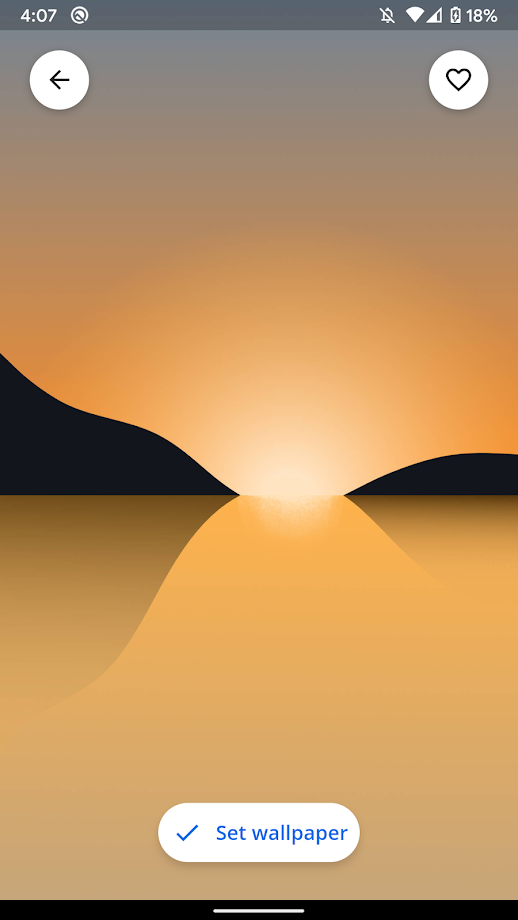

# Flutter Wallpaper App

  

      <td style="text-align: center">
        
      </td>
      <td style="text-align: center">
        
      </td>
      <td style="text-align: center">
        
      </td>
      <td style="text-align: center">
        
      </td>
    

## Tools
- Firebase Cloud Firestore
- Firebase Storage
- SQLite

For a full description see pubspec.yaml

## License
MIT
